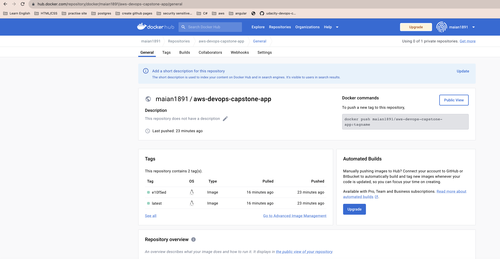
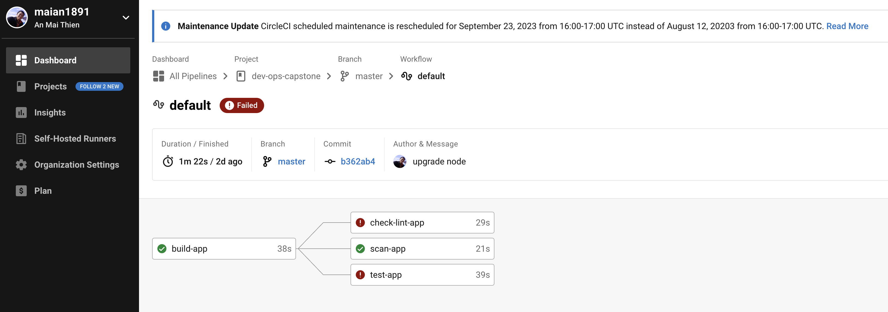
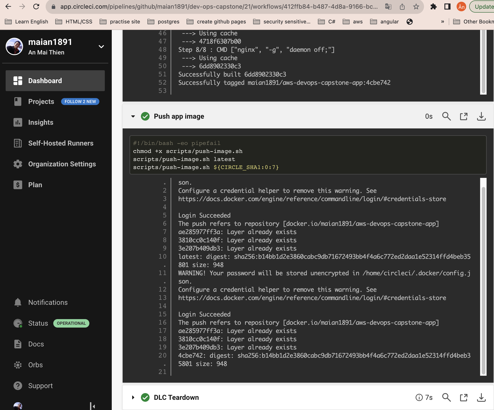

# Udacity - Cloud DevOps Engineer - Capstone - Project quick view

1. The project uses a centralized image repository to manage images built in the project. After a clean build, images are pushed to the repository.

2. Code is checked against a linter as part of a Continuous Integration step (demonstrated w/ two screenshots)

3. The project takes a Dockerfile and creates a Docker container in the pipeline.

4. The cluster is deployed with CloudFormation or Ansible. This should be in the source code of the student’s submission.

5. The project performs the correct steps to do a blue/green or rolling deployment into the environment selected. Submit the following screenshots as evidence of the successful completion of chosen deployment methodology:
    1. Screenshot of the Circle CI or Jenkins pipeline showing all stages passed successfully.
    

    2. Screenshot of your AWS EC2 page showing the newly created (for blue/green) or modified (for rolling) instances running as the EKS cluster nodes.
    
    
    
    
    
   